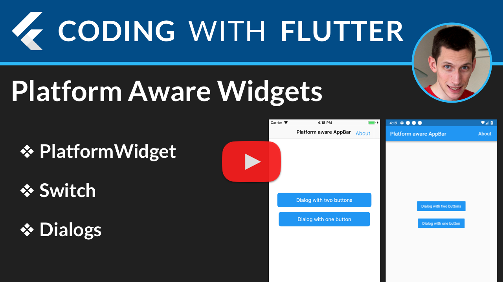

## Flutter Platform Aware Widgets

Example project showing how to create platform-aware widget classes in Flutter.

[](https://youtu.be/0q2beiiXD98)

## Rationale

Flutter has a rich set of Material and Cupertino widgets that can be used to build beautiful looking UIs on Android and iOS.

However, tailoring apps to adopt platform specific conventions can result in a lot of conditionals:

```dart
if (Platform.isIOS) {
  // return Cupertino widget
} else {
  // return Material widget
}
```

This project shows how to abstract away this logic by defining a base `PlatformWidget` class, that can be subclassed as needed.

This demo shows this approach in practice with a small set of platform-aware widgets. 

## Supported widgets

* `PlatformSwitch`
* `PlatformAlertDialog` and `PlatformAlertDialogAction`
* `PlatformButton`
* `PlatformScaffold` and `PlatformAppBar`

### Credits

- [Swav Kulinski - Do Flutter apps dream of platform aware widgets?](https://medium.com/flutter-io/do-flutter-apps-dream-of-platform-aware-widgets-7d7ed7b4624d)

### For more articles and video tutorials, check out [Coding With Flutter](https://codingwithflutter.com/).

### [License: MIT](LICENSE.md)
